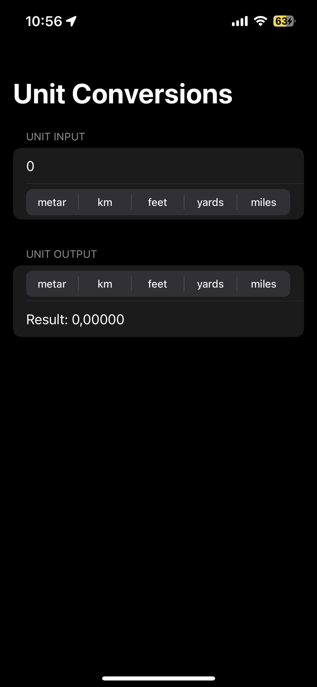
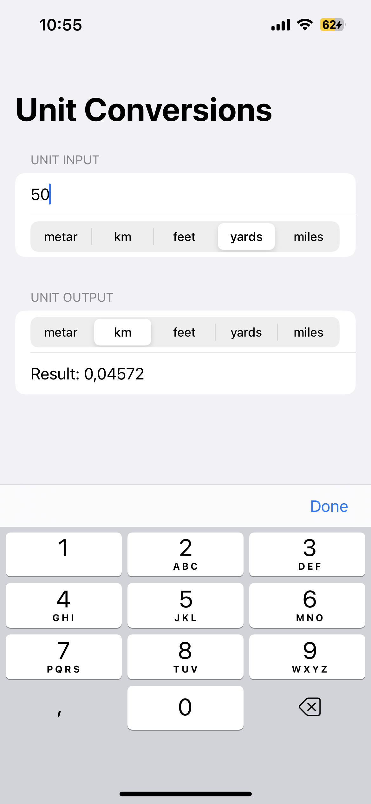
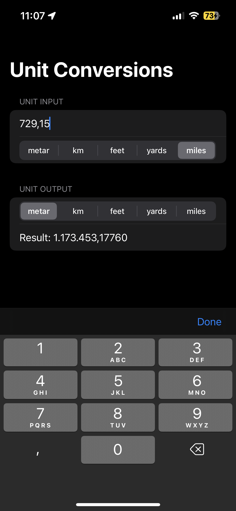

# UnitConversion-SwiftUI
## A Simple SwiftUI application to convert units of length

- ### Application preview on the physical iOS device -> ***dark mode***

- ### Setting input value and metric, setting output metric -> ***light mode***

- ### Setting input value and metric, setting output metric -> ***light mode version***

